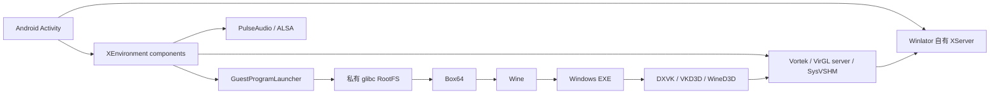

# Winlator 11.x 运行架构与 Games 资源复用评估

> 调研日期：2026-08-30  
> 目标：判断 Winlator 是否能够为 Games 的 `GLIBC_TERMUX_BOX` 与 `ROOTFS_PROOT` 两套运行模式提供完整资源，并给出可实施的复用边界。  
> 结论先行：Winlator 提供了较完整的 Windows 游戏兼容栈样本，但不是可直接接入的组件仓库。DXVK/VKD3D 等 PE 运行库复用成本低；RootFS、Box64、Turnip 必须重建或重新打包；Vortek、Gladio、Winlator VirGL 与其自有 XServer/渲染服务强耦合，不能直接接到 Termux:X11。

> 实施决策（2026-08-30）：同时正式支持 `GLIBC_TERMUX_BOX` 与 `ROOTFS_PROOT`。PRoot 首个可发布基线采用 Debian 13 + Hangover 11.9 + VirGL + WineD3D；VirGL 不提供 Vulkan，因此该基线不声明 DXVK。缺少 RootFS 组件时保留 profile 并阻断启动，不自动回退 GLIBC。

## 1. 调研范围与版本基线

官方来源：

- [Winlator 主仓库](https://github.com/brunodev85/winlator)
- [Winlator App 源码仓库](https://github.com/brunodev85/winlator-app)
- [Winlator Releases](https://github.com/brunodev85/winlator/releases)
- [Vortek](https://github.com/brunodev85/vortek)
- [Gladio](https://github.com/brunodev85/gladio)

本报告核对了以下源码状态：

| 对象 | 提交/版本 | 状态 |
|---|---|---|
| Winlator 主仓库 `main` | `5949297d9dc83ad24ce3f5119fe382da7c899a78` | 2026-08-19 |
| 主仓库 `main` 的 `app` 子模块 | `c03f6ab558c6f94cbac6ec0c791b12f3428fbdf6` | App `versionName=11.2` |
| Winlator App 仓库 `main` | `4f55d117fff1542944e5b91f433470445160ce08` | 额外包含后台前台服务修复 |
| 最新稳定版 | `v11.1.0`，2026-06-12 | APK SHA-256 `80bdea17d8497a2ae0ff637e68d82a884ccc5ca4406880950b96fd2483e50970` |
| 最新预发布版 | `v11.2.0`，2026-08-19 | APK SHA-256 `4b7098d86bdfb88447c950d7b05e155da01af714f29676d4e997034e5593285a` |

### 1.1 发布源码存在可复现性缺口

`v11.2.0` 标签指向主仓库提交 `fb66541b93a4eb3ee585a433b4c7b20544d58e40`，该标签内 `app` 子模块仍指向 `c2f4ad4534f4637b543a9a3b085e28f50cf6d01c`：

- `versionName=11.1`
- `versionCode=28`
- 默认 Box64 `0.4.0`

但 `v11.2.0` 发布说明和 APK 对应的是：

- `versionName=11.2`
- `versionCode=32`
- 默认 Box64 `0.4.4`

符合这些信息的 App 提交是 `c03f6ab...`，提交时间晚于 Release 发布时间。即官方 `v11.2.0` 标签不能独立复现其 APK。Games 不应直接把 Release APK 中的二进制拆出后作为可信生产源，必须建立自己的源码提交、构建环境、SHA-256、许可证和产物证明链。

## 2. Winlator 11.x 的真实运行模型

Winlator 11.x 当前源码中没有 PRoot 启动链。它的“容器”不是 Linux distro 容器，而是共享 glibc RootFS 下的独立 Wine prefix 和用户目录。



核心代码：

- [`RootFS.java`](https://github.com/brunodev85/winlator-app/blob/c03f6ab558c6f94cbac6ec0c791b12f3428fbdf6/app/src/main/java/com/winlator/xenvironment/RootFS.java)：RootFS 位于 `<files>/rootfs`，固定用户 `xuser`，主 Wine 位于 `/opt/wine`。
- [`RootFSInstaller.java`](https://github.com/brunodev85/winlator-app/blob/c03f6ab558c6f94cbac6ec0c791b12f3428fbdf6/app/src/main/java/com/winlator/xenvironment/RootFSInstaller.java)：直接解压 `assets/rootfs.tzst`，11.2 的 `LATEST_VERSION=22`。
- [`GuestProgramLauncherComponent.java`](https://github.com/brunodev85/winlator-app/blob/c03f6ab558c6f94cbac6ec0c791b12f3428fbdf6/app/src/main/java/com/winlator/xenvironment/components/GuestProgramLauncherComponent.java)：以 Android 普通子进程执行 `<rootfs>/usr/local/bin/box64 <wine command>`。

实际环境拼接方式：

```text
HOME=<rootfs>/home/xuser
TMPDIR=<rootfs>/tmp
PATH=<rootfs>/<wine>/bin:<rootfs>/usr/local/bin:<rootfs>/usr/bin
LD_LIBRARY_PATH=<rootfs>/usr/lib
BOX64_LD_LIBRARY_PATH=<rootfs>/lib/x86_64-linux-gnu
DISPLAY=:0
```

这与现有 `GLIBC_TERMUX_BOX` 的技术方向一致：都依赖 Android 可直接执行的 AArch64 glibc loader/运行库，再由 Box64 执行 x86_64 Wine。差异主要是目录布局、组件版本、XServer 和渲染服务。

## 3. RootFS 与“容器”拆解

### 3.1 RootFS 生命周期

Winlator 内置 `rootfs.tzst`，安装/升级流程为：

1. 保留 `<rootfs>/home`。
2. 保留 `<rootfs>/opt/installed-wine`。
3. 删除 RootFS 其余目录和 `/opt` 下其他内容。
4. 将新 `rootfs.tzst` 直接解压到原路径。
5. 写入 `.winlator/.rfs_version`。
6. 标记部分 Wine prefix 需要升级。

缺失能力：

- 没有 `active`/`previous` 双版本目录。
- 没有安装 staging。
- 没有原子切换。
- 没有失败回滚。
- 内置资产依赖 APK 签名保护，但在线安装组件没有独立摘要校验。

Games 已实现的 staging、SHA-256、原子安装和回滚不能被 Winlator 的安装器替代。

### 3.2 Winlator “容器”是什么

每个容器实质为：

- `<rootfs>/home/xuser-<id>` 用户目录。
- 独立 `.wine` prefix。
- `.container` JSON 配置。
- 启动前把 `<rootfs>/home/xuser` 切换为目标用户目录的符号链接。
- 通过 `container_pattern.tzst` 创建 Wine prefix 骨架。

配置覆盖：

- Wine 版本。
- 屏幕尺寸和 DPI。
- Vulkan/OpenGL 驱动及驱动参数。
- DX wrapper 及参数。
- 音频驱动及参数。
- WinComponents。
- Windows 版本。
- 盘符映射。
- 环境变量。
- x86_64/WoW64 CPU affinity。
- Box64 preset。
- HUD、启动服务集合、桌面主题。

因此它更接近“共享运行时 + 每游戏/每容器 Wine prefix”，不提供 Debian/Ubuntu 用户空间、包管理器或通用 Linux 容器语义。

## 4. 内置资源清单

以下为 App `c03f6ab...` 的 11.2 资产快照：

| 类别 | 默认版本 | 压缩大小 | 归属与用途 |
|---|---:|---:|---|
| RootFS | rfs 22 | 65.25 MB | AArch64 glibc 用户空间、Wine 依赖、X11/音频依赖 |
| RootFS patches | 11.2 | 4.17 MB | 启动时覆盖 RootFS 的补丁 |
| Container pattern | 11.2 | 7.40 MB | Wine prefix 基础模板 |
| Box64 | 0.4.4 | 4.54 MB | x86_64 Linux 用户态翻译 |
| Turnip | 26.1.0 | 2.51 MB | Adreno Vulkan guest driver |
| VirGL guest | 23.1.9 | 3.48 MB | OpenGL guest `libGL` |
| Vortek guest | 2.1 | 0.12 MB | Winlator 自有 Vulkan guest/client |
| Gladio guest | 1.1 | 0.11 MB | Winlator 自有 OpenGL guest/client |
| Zink | 22.2.5 | 3.87 MB | OpenGL over Vulkan |
| DXVK | 1.10.3 / 2.4.1 | 3.55 / 4.32 MB | D3D9/10/11 over Vulkan |
| VKD3D-Proton | 2.14.1 | 2.36 MB | D3D12 over Vulkan |
| D7VK | 1.11 | 2.84 MB | D3D1-7 兼容层 |
| D8VK | 1.0 | 1.85 MB | D3D8 兼容层 |
| CNC-DDraw | 6.6 | 0.17 MB + shaders | 旧版 DirectDraw |
| WinComponents | 多项 | 约 31 MB+ | Direct3D/Music/Play/Show/Sound、VC runtimes、WM decoder、XAudio |
| PulseAudio payload | 内置 | 约 45 KB | 配置/模块载荷；核心实现还依赖 JNI 库 |

下载并核对的内置归档：

| 文件 | SHA-256 |
|---|---|
| `box64-0.4.4.tzst` | `e1a34fed50bb38ef7fbf51ad5e5b9a76ec4c8178f9cfb4b9f6def0497f2f446c` |
| `turnip-26.1.0.tzst` | `9b4a10975456197e403c2b6a8a9781a8fd42ccf5048262a8cdea6538bb68d288` |
| `virgl-23.1.9.tzst` | `614b1edc8e47c57b2cbb2d96f9c7ab5f5b1a89038de618a58b2faf9c64380e09` |
| `dxvk-2.4.1.tzst` | `897cc48500241006c15c62f200e9a6e1ea8a674bd285da25df6f68fdcdbfe42e` |
| `vkd3d-2.14.1.tzst` | `354b43b84df136683c7ad9cb80e125b4a357de7459fab9ac8b56d5fe4a617687` |

这些摘要是本次从指定 Git blob 提取后的校验值，不是 Winlator 官方发布的组件 manifest。若接入 Games，必须由我们的构建流水线重新生成并签署索引。

## 5. 在线组件仓库拆解

主仓库 `installable_components/` 目前提供以下历史版本：

| 类型 | 可下载版本样本 |
|---|---|
| Box64 | 0.3.3、0.3.5、0.3.7 |
| DXVK | 0.96、1.4.2、1.7.2、2.2、2.3.1、2.5.2、2.6.1 |
| Turnip | 24.1.0、25.0.0、26.0.3 |
| VKD3D | 2.12、2.14.1、3.0b |
| WineD3D | 4.21、7.8、10.0 |

[`GeneralComponents.java`](https://github.com/brunodev85/winlator-app/blob/c03f6ab558c6f94cbac6ec0c791b12f3428fbdf6/app/src/main/java/com/winlator/core/GeneralComponents.java) 的协议只是：

1. 下载 `index.txt`。
2. 将每行当作文件名。
3. 从 GitHub Raw 下载对应归档。
4. 直接写入 `installed_components/<type>`。

其组件索引不包含：

- 文件大小。
- SHA-256。
- 签名。
- ABI/架构声明。
- 依赖关系。
- 与 RootFS 的兼容区间。
- 源码提交和构建参数。
- License/SBOM。

[`HttpUtils.java`](https://github.com/brunodev85/winlator-app/blob/c03f6ab558c6f94cbac6ec0c791b12f3428fbdf6/app/src/main/java/com/winlator/core/HttpUtils.java) 只接受 HTTP 200 并覆盖目标文件，没有 Range、ETag、断点续传、摘要校验和镜像策略。

[`TarCompressorUtils.java`](https://github.com/brunodev85/winlator-app/blob/c03f6ab558c6f94cbac6ec0c791b12f3428fbdf6/app/src/main/java/com/winlator/core/TarCompressorUtils.java) 直接将 tar entry 拼到目标目录，没有 canonical path 越界检查，也没有符号链接逃逸检查；所有条目统一 `chmod 0771`。

结论：在线目录适合作为版本发现和兼容性样本源，不适合作为 Games 生产组件索引。Games 已有的下载、断点续传、校验、staging、回滚链路必须保留。

## 6. 二进制可移植性

### 6.1 Box64：必须重建

Winlator 11.2 的 Box64 ELF 包含硬编码解释器：

```text
/data/data/com.winlator/files/rootfs/lib/ld-linux-aarch64.so.1
```

同时 RUNPATH 指向：

```text
/data/data/com.winlator/files/rootfs/lib
```

因此该二进制离开 `com.winlator` 包名和其 RootFS 布局后不能可靠启动。可复用的是：

- Box64 0.4.4 版本选择。
- 默认 `box64rc`。
- Conservative/Intermediate/Aggressive/Safe 等 preset 的环境变量组合。
- 针对游戏的 RC 规则样本。

必须由 Games/TermuxBox 工具链重建 Box64，并把动态加载器和 RUNPATH 定向到我们的 glibc prefix 或采用可重定位方案。

### 6.2 Turnip：必须与目标 ABI 一起重建/验证

Winlator Turnip 依赖其 RootFS 中的 glibc、`libdrm`、X11/XCB、`libstdc++`、`libz` 等。它不是只包含一个无依赖 Vulkan 驱动的独立包。

可复用：版本选择、ICD 配置、环境变量和兼容性经验。  
不能直接复用：Winlator 构建出的 `.so`，除非 Games 的目标 RootFS ABI、依赖版本、GPU/AdrenoTools 接口经过完整验证。

### 6.3 VirGL：guest 库和 server 必须成对适配

归档中的 `libGL.so.1.7.0` 依赖 RootFS 的 X11、DRM、GLAPI、expat、glibc。Winlator 的 VirGL server 还直接访问其自有 Java XServer drawable 完成帧输出。

Termux:X11 路线需要：

- 使用能向 Termux:X11 输出的 VirGL server。
- 固定 guest `libGL` 与 server 协议版本。
- 明确 socket、shared-memory 和 drawable 路径。

不能只把 `virgl-23.1.9.tzst` 解压进 Games RootFS。

### 6.4 Vortek / Gladio：不能作为独立驱动直接接入

Vortek 是自定义 Vulkan client/server；Gladio 是自定义 OpenGL client/server。两者都依赖 Winlator native server、Unix socket 协议、hardware buffer 以及自有 XServer 的 drawable 生命周期。

若要在 Games 中支持它们，有两种路线：

1. 移植整个 server 和协议，并为 `X11SessionView`/Termux:X11 增加 renderer bridge。
2. 重新设计成标准 Wayland/X11/Android HardwareBuffer 外部内存路径。

这不是“增加两个组件包”，而是独立的渲染后端项目。当前应保持不可选，不能像现有 `GlibcTermuxBoxBackend` 一样把 `vortek/gladio` 名称映射为 Turnip；这种映射会产生虚假的配置语义。

### 6.5 DXVK / VKD3D / D7VK / D8VK / CNC-DDraw：优先复用

这些归档主要是 x86/x86_64 Windows PE DLL 和配置文件，对 Android 包名、AArch64 loader 的耦合最低。

接入前仍需：

- 从对应上游源码/Release 重新获取或构建，而不是只复制 Winlator blob。
- 保存上游 commit/tag、构建参数和许可证。
- 将 `system32`/`syswow64` 安装规则写入组件 manifest。
- 用 Wine prefix staging 安装并支持卸载/回滚。
- 对 D3D8、D3D9、D3D10/11、D3D12、DDraw 分开建模，不能用单个 `dxWrapper` 字符串覆盖全部选择。

## 7. 图形、音频、输入与运行控制

### 7.1 图形驱动组合

Winlator 11.2 提供：

- Vulkan：Turnip、Vortek。
- OpenGL：Zink、VirGL、Gladio。
- DirectX：DXVK、VKD3D、D7VK、D8VK、CNC-DDraw、WineD3D。

默认策略：Adreno 设备偏向 Turnip + Gladio，非 Adreno 设备偏向 Vortek + Gladio；DXVK 会根据 Vulkan 能力选择 1.10.3 或 2.4.1。

Games 需要把当前单一 `graphicsDriver` 拆成至少三个正交维度：

```text
vulkanDriver = turnip | system-wrapper | none
openGLDriver = zink | virgl | native-gl | none
directXStack = dxvk + vkd3d + legacy-wrapper versions
```

否则无法表达 Winlator 已支持的组合，也无法做准确的 preflight。

### 7.2 音频

Winlator 支持 ALSA 路线与 native PulseAudio component。其 PulseAudio 不是只依赖 `pulseaudio.tzst`，还依赖 APK JNI/native library 和模块目录。

Games 应继续使用 Termux 生态的 PulseAudio/ALSA 能力，不应复制 Winlator JNI 方案。可借鉴：

- 每容器音频 backend 选择。
- latency/buffer 配置。
- 启动前 socket 探测。
- 游戏退出后的 server 引用计数和清理。

### 7.3 输入与运行中菜单

Winlator 自有 XServer 集成了：

- Android 软键盘。
- 虚拟手柄编辑器。
- 外接手柄映射。
- 相对鼠标/触控板模式。
- 活动窗口列表和 task manager。
- 放大镜、屏幕特效、全屏、PIP、日志。
- 返回键打开侧边 Drawer，退出需要显式操作。

对应源码菜单见 [`xserver_menu.xml`](https://github.com/brunodev85/winlator-app/blob/c03f6ab558c6f94cbac6ec0c791b12f3428fbdf6/app/src/main/res/menu/xserver_menu.xml)。

这些 UI/交互可以作为 `GameSessionActivity` 的功能基线，但输入、窗口管理和 drawable 操作依赖 Winlator XServer API。Games 必须通过独立 `X11SessionView`/Termux:X11 adapter 实现，不能引入 Winlator Activity 或 XServer 组件，以免破坏用户要求的“游戏模式与终端+X11 两套独立交互”。

### 7.4 生命周期

11.2 对 Activity 暂停的处理是枚举 guest 子进程并发送 SIGSTOP，恢复时 SIGCONT。App 仓库当前 `main` 又增加前台服务，避免容器后台被系统回收。

Games 已有持久 `LaunchTask`、前台任务、JSONL 事件链，不应照搬静态 PID 和 Activity 生命周期控制。可补充：

- task 级 process group/cgroup 标识。
- 明确 `KEEP_RUNNING`、`SUSPEND_ON_BACKGROUND`、`STOP_ON_BACKGROUND` 策略。
- 前台服务恢复时从 `LaunchTask` 和 pidfile 重建状态。

## 8. 许可证与供应链边界

Winlator 主仓库、App、Vortek、Gladio均声明 LGPL-2.1，但 APK/RootFS 内含多个许可证不同的上游项目：Wine、Box64、Mesa、DXVK、VKD3D-Proton、CNC-DDraw、Termux Pacman glibc patches 等。

当前 RootFS 和组件归档中没有形成完整的：

- SPDX/CycloneDX SBOM。
- 每个二进制的源码 commit。
- 可复现构建脚本和 toolchain 锁定。
- 许可证文件集合。
- LGPL/GPL 对应源码提供关系。
- 构建产物签名和 provenance。

因此：

- 代码可以依照各仓库许可证评估后复用。
- 二进制归档只可作为逆向兼容性和布局样本。
- 正式分发应优先从上游重建，并在 Games 组件索引中记录 `sourceUrl`、`sourceRevision`、`license`、`buildRecipeRevision` 和 SHA-256。

## 9. 与当前 Games/TermuxBox 的重叠情况

现有 `games/src/main/assets/termux-box-packages/index-v1.json` 已包含：

- `glibc-prefix`
- `box64-binaries`
- 多个 Wine 8.18—9.3 包
- `turnip`
- `virgl-mesa`
- `dxvk`
- `wined3d`
- `prefix-apps`、`libudev`、`locale`、`scripts`

TermuxBox 的 `dxvk` 组件本身已有 DXVK、D8VK、VKD3D、DXVK Async 等变体。因此 Winlator 并没有补上一个此前不存在的基础运行栈；其主要增量是：

- 更近的 Box64/Turnip 版本参考。
- 独立 D7VK/D8VK/CNC-DDraw 选择。
- WinComponents 目录。
- 更完整的 per-container/per-game 参数模型。
- Vortek/Gladio 自有渲染路线。
- Wine prefix 模板和容器配置经验。

## 10. 逐项复用决策

| 资源/能力 | `GLIBC_TERMUX_BOX` | `ROOTFS_PROOT` | 决策 |
|---|---|---|---|
| Winlator RootFS | 不直接使用 | 不能直接使用 | 仅作为依赖清单和目录布局参考；自行构建 |
| Box64 二进制 | 不可直接使用 | 不可直接使用 | 基于 0.4.4+ 源码重建，修复 loader/RUNPATH |
| Box64 presets/rc | 可迁移 | 可迁移 | 转换为 Games profile schema，保留来源和版本 |
| Wine | TermuxBox 已有 | distro/自建 RootFS 提供 | 继续使用可追溯构建；补版本导入协议 |
| Turnip | 已有，升级版本 | 必须匹配 RootFS ABI | 从 Mesa/Turnip 上游重建 |
| VirGL guest | 已有 | 必须匹配 RootFS/server | 以 Termux:X11 server 兼容性为准 |
| Vortek | 暂不可用 | 暂不可用 | 独立 renderer bridge 项目 |
| Gladio | 暂不可用 | 暂不可用 | 独立 renderer bridge 项目 |
| DXVK | 已有 | 可用 | 从上游补版本和 prefix installer |
| VKD3D | 已有 | 可用 | 从上游补版本和能力检测 |
| D7VK/D8VK/CNC-DDraw | 部分已有 | 可用 | 拆成独立 legacy wrapper 组件 |
| WinComponents | 可新增 | 可新增 | 先建立许可证/来源清单，再按需引入 |
| PulseAudio | Termux 生态已有 | 容器内或 host bridge | 不复制 Winlator JNI 实现 |
| 下载/校验/安装 | Games 已有且更完整 | Games 已有且更完整 | 保留现有链路 |
| Wine prefix 模板 | 可借鉴 | 可借鉴 | 自行生成、版本化、可迁移 |
| 运行中菜单 | 交互可借鉴 | 交互可借鉴 | 在 Games Activity 内独立实现 |

## 11. 对“两套运行模式”的架构修正

现有设计：

```text
GLIBC_TERMUX_BOX
ROOTFS_PROOT
```

Winlator 调研说明，“独立 RootFS”与“PRoot 容器”不是同一件事。需要明确容器模式的目标：

### 方案 A：独立文件系统隔离，追求游戏性能

建议改为：

```text
GLIBC_TERMUX_BOX
GLIBC_COMPOSED_ROOTFS
```

第二套模式采用 Winlator 式私有 glibc RootFS，但由 Games 自己构建和管理，不使用 PRoot。优点：

- 少一层 PRoot syscall translation。
- 与 Box64/Wine/Turnip 的性能路线一致。
- 可以做 immutable `active/previous` RootFS。
- 各运行时依赖完全由 composed image 固定。

### 方案 B：真正的 Debian/Ubuntu 容器，追求生态兼容

保留：

```text
GLIBC_TERMUX_BOX
ROOTFS_PROOT
```

第二套模式使用 Debian/Ubuntu RootFS、PRoot 和容器内包管理。Winlator 只能提供 DXVK/VKD3D/配置参考，不能提供所需 distro RootFS。该路线适合验证容器内依赖和 Hangover/Wine，但性能和 Android 图形桥接复杂度更高。

### 建议

若“容器”只是面向用户的隔离概念，采用方案 A。若明确要求容器内 `apt`、标准 FHS 和发行版依赖，保留方案 B，并新增方案 A 作为后续高性能后端。不要把 Winlator RootFS 塞入 `ROOTFS_PROOT` 后继续沿用错误语义。

## 12. 需要立即修正的现有问题

1. `GlibcTermuxBoxBackend` 当前把 `vortek`/`gladio` 选择映射到 `turnip` 组件。这只保证组件 preflight 通过，却不提供对应运行能力。应删除伪映射，未实现的 renderer 返回明确的 `unsupported_renderer`。
2. `RuntimeProfile.graphicsDriver` 同时表达 Vulkan/OpenGL renderer，粒度不足。需要 schema 升级。
3. `dxWrapper` 不能表达 DXVK + VKD3D + legacy DirectX 的组合和各自版本。需要拆分。
4. `ROOTFS_PROOT` 当前默认值 `rootfs-turnip`、`rootfs-dxvk` 只是字符串约定，必须由 RootFS manifest 的 capabilities 决定，不允许凭名称通过 preflight。
5. RootFS 组件 manifest 需要新增 ABI、loader、库依赖、renderer protocol、Wine/Box64 兼容区间。

## 13. Harness 实施分片建议

### P0：资源治理与模型纠偏

- 新建 Winlator/upstream 组件来源清单和许可证矩阵。
- 给组件索引增加 `sourceUrl`、`sourceRevision`、`license`、`abi`、`requires`、`provides`、`conflicts`。
- 删除 Vortek/Gladio 到 Turnip 的伪映射。
- 将 profile 拆为 `vulkanDriver`、`openGLDriver`、`directXStack`、`legacyDirectXWrapper`。
- RootFS preflight 读取能力 manifest，不再只检查文件存在和字符串列表。

验收：错误选择在提交 LaunchTask 前给出结构化错误；旧 profile 可迁移且不把 Vortek/Gladio 默认为 Turnip。

### P1：低耦合兼容组件

- 从上游构建/引入 DXVK、VKD3D、D7VK、D8VK、CNC-DDraw。
- 实现 Wine prefix 内的 staging 安装、DLL override 和回滚。
- 增加 VC runtime、XAudio、DirectMusic/Play/Show 等 WinComponents，但逐项完成许可证和来源核对。
- 移植 Box64 presets/rc 到 Games profile。

验收：每个组件有 SHA-256、来源 revision、许可证；安装失败不污染当前 prefix；每游戏可冻结独立版本。

### P2：高性能 composed RootFS

- 决定是否新增 `GLIBC_COMPOSED_ROOTFS`。
- 建立可复现 RootFS 构建脚本，不复制 Winlator `rootfs.tzst`。
- 重建 Box64，消除包名硬编码 loader/RUNPATH。
- 建立 `active`/`previous` RootFS、原子切换和回滚。
- 与 Termux:X11 adapter 联调 Turnip/Zink/VirGL。

验收：RootFS 可从锁定源码和工具链重建；任一组件/RootFS 更新可回滚；不依赖 `com.winlator` 路径。

### P3：自有 renderer 评估

- 为 Vortek/Gladio 单独做协议、native server 和 Termux:X11 drawable bridge PoC。
- 对比 Turnip/Zink/VirGL 的兼容性和帧延迟收益。
- 只有 PoC 证明收益后才加入正式 component catalog。

验收：渲染后端拥有真实 capability，不通过名称别名冒充其他实现；与终端+X11 模式无共享 Activity 状态。

## 14. 最终判断

“所需资源是否都在 Winlator”需要拆成三层回答：

1. **功能栈样本基本齐全**：Box64、Wine 运行环境、Turnip/VirGL/Vortek/Gladio、DXVK/VKD3D、legacy DirectX、WinComponents、prefix 模板和运行参数都有参考价值。
2. **可直接分发的生产组件并不齐全**：RootFS 和大多数 AArch64 native 库缺少可复现构建、完整许可证/SBOM、独立 manifest 和跨包名可移植性。
3. **对 Games 最有价值的是架构验证和配置目录，不是整体搬运**：现有 TermuxBox 已覆盖基础栈；应吸收 Winlator 的版本、兼容组件和参数模型，同时保留 Games 更完整的下载、校验、staging、回滚和持久任务体系。

推荐落点：优先完成 P0/P1；将 Winlator 式原生 glibc composed RootFS 作为高性能第二后端设计，不把它误实现成 PRoot 容器；Vortek/Gladio 暂列独立研发项。
