# 盖世游戏完整录屏：本地游戏 UI、交互与 Games 改造建议

> 分析对象：`gamehub.mp4`  
> 录屏时长：5 分 06 秒；分辨率：1280 × 720；分析日期：2026-08-28  
> 范围：本地 PC 游戏、PC 引擎设置、组件、启动、运行中控制中心。云游戏、社区、账号体系仅用于识别全局导航，不纳入实现范围。  
> 说明：文中“观察”来自录屏画面；“推断”是基于交互结果的产品判断。

## 1. 结论

盖世游戏的本地游戏体验由五个稳定容器组成：

1. 自适应游戏库：竖屏使用底部导航，横屏使用顶部导航。
2. 游戏操作弹层：查看详情与更多操作均覆盖在游戏库上，不跳转重型详情页。
3. PC 引擎设置：横屏主从布局，左侧固定分类，右侧配置内容。
4. 启动阶段：全屏、低信息密度，只展示环境检查、阶段进度和 Windows 启动状态。
5. 运行中控制中心：从右侧覆盖游戏画面，保留游戏上下文；操作、性能、系统、键盘、退出集中在同一入口。

当前 Games 模块已经具备游戏导入、Repository/Orchestrator、组件下载、持久任务、运行配置、启动任务和 X11 Session 的底层能力，但 UI 结构仍是普通手机应用：底部“游戏库/组件/设置”、导入 Hero、两列网格、独立全屏详情页。继续修饰颜色、圆角不会接近竞品，必须调整页面容器和导航模型。

## 2. 产品心智模型

盖世游戏没有把 Termux/Wine/翻译器/图形驱动暴露为一组工具，而是把它们包装成“每个游戏拥有一台可配置的 PC”。

- 游戏是一级对象。
- PC 引擎设置是游戏的附属配置，不是全局设置中心。
- 组件是配置项的可选实现，不是用户必须理解的独立下载仓库。
- 启动是有阶段的任务，但默认隐藏日志和命令。
- 终端、Wine 容器、CPU 翻译器均属于运行基础设施，不参与主导航。
- 高级能力逐层下沉：游戏库 → 更多 → PC 引擎设置 → 兼容性/开发者选项。

这与 Games 的目标一致：Termux 负责软件包、进程和环境，用户只看到游戏、设置、启动状态和游戏画面。

## 3. 主流程与页面关系

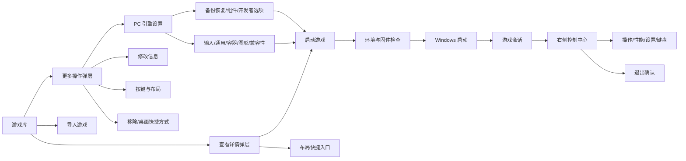
```mermaid
flowchart LR
    A[游戏库] --> B[查看详情弹层]
    A --> C[更多操作弹层]
    A --> D[导入游戏]
    B --> E[启动游戏]
    B --> F[布局快捷入口]
    C --> G[PC 引擎设置]
    C --> H[修改信息]
    C --> I[按键与布局]
    C --> J[移除/桌面快捷方式]
    G --> K[输入/通用/容器/图形/兼容性]
    G --> L[备份恢复/组件/开发者选项]
    K --> E
    L --> E
    E --> M[环境与固件检查]
    M --> N[Windows 启动]
    N --> O[游戏会话]
    O --> P[右侧控制中心]
    P --> Q[操作/性能/设置/键盘]
    P --> R[退出确认]
```

关键点：详情、更多、选择器、确认框都是上下文弹层；只有配置中心、布局市场和游戏会话属于全屏页面。

## 4. 录屏时间轴

| 时间 | 界面/动作 | 关键观察 |
|---|---|---|
| 00:02–00:08 | 进入游戏库并旋转横屏 | 本地 PC 游戏场景主动转为横屏；导航从底部切到顶部 |
| 00:14 | 横屏游戏库 | 大封面、游戏名、“查看详情”、更多按钮；下方为 Steam/Epic/导入等入口 |
| 00:18 | 查看详情 | 居中大弹层；说明信息较轻；“启动游戏”是唯一强主操作 |
| 00:20 | 更多 | 锚定式小菜单，包含 PC 引擎设置、桌面快捷方式、移除、修改信息、按键与布局 |
| 00:22–01:16 | PC 引擎设置 | 左侧分类、右侧表单；选择器与编辑器使用居中弹窗 |
| 01:18–01:20 | 启动与桌面 | Windows 标志、连接 Toast、虚拟按键覆盖层 |
| 01:46–03:10 | 运行中控制中心 | 右侧抽屉；操作、性能、设置、键盘、进程、HUD、退出 |
| 03:14–04:20 | 深入引擎配置 | GPU、DXVK、VKD3D、VRAM、Proton、FEX、DInput、备份、组件、开发者选项 |
| 04:24 | 再次启动 | 明确显示“正在检查环境和固件… 1/3” |
| 04:48–05:02 | 竖屏游戏库 | 顶部 PC 游戏/复古游戏，底部五栏；详情和更多变为底部 Sheet |

## 5. 游戏库拆解

### 5.1 横屏形态

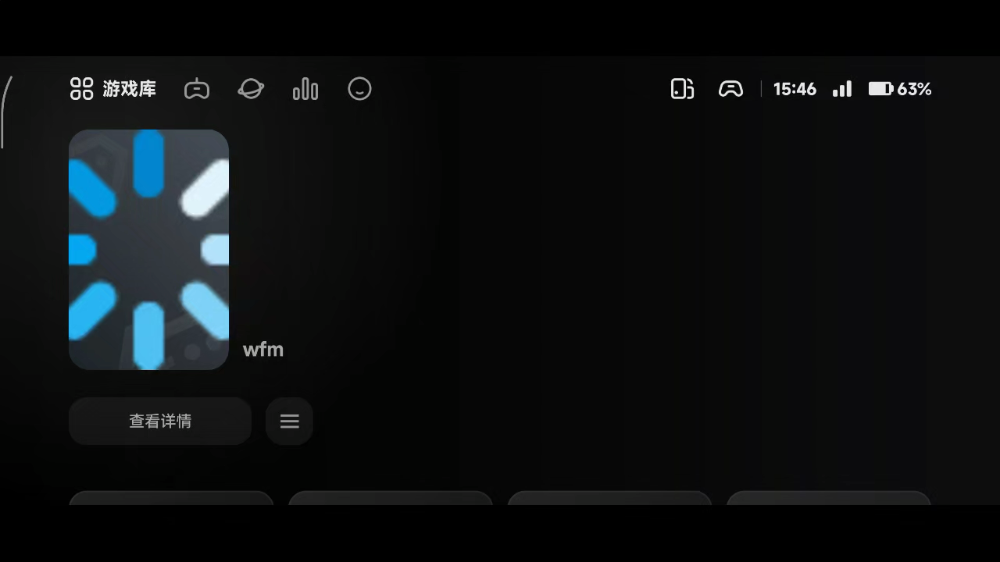

页面结构：

- 顶部为全局导航和设备状态，当前“游戏库”用高亮文字和图标表示。
- 游戏内容从左上开始排列，单个游戏使用大尺寸竖版封面，而非铺满屏幕的卡片网格。
- 封面下方把“查看详情”和更多按钮拆开，避免卡片整块点击的歧义。
- 下方是一排大入口：我的游戏、Steam、Epic、导入游戏。
- 背景保持黑色，仅卡片和弹层使用半透明深灰；信息密度明显低于当前 Games 页面。

交互意图：横屏首先服务手柄、电视和游戏过程中返回；焦点顺序清晰，大尺寸目标适合遥控器/手柄导航。

### 5.2 竖屏形态

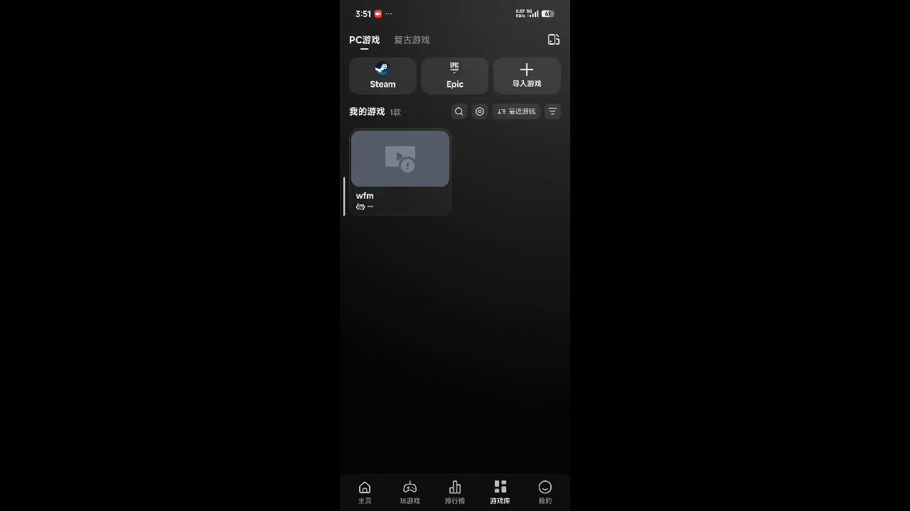

- 顶部局部 Tab：PC 游戏、复古游戏。
- Steam、Epic、导入游戏变为顶部三块快捷卡。
- 游戏区提供搜索、排序/筛选、展示方式切换。
- 底部为五个全局导航：主页、玩游戏、排行榜、游戏库、我的。
- 游戏卡改为横向封面比例和紧凑网格。

因此竞品不是“把横屏 XML 旋转一下”，而是共享状态、分别编排横竖屏导航和内容密度。

### 5.3 对 Games 的直接要求

- Games 模式进入本地 PC 游戏后优先横屏；竖屏保留可用但不是主设计基准。
- 横屏移除当前底部“游戏库/组件/设置”导航。
- 组件不应是一级 Tab；全局组件任务可放在工具/设置入口，具体版本选择应嵌入游戏配置。
- 移除大面积导入 Hero；导入作为固定快捷卡或空状态主操作。
- 游戏库列表需要支持手柄焦点、封面缺失、权限失效、运行中、组件缺失等状态。

## 6. 详情与更多操作

### 6.1 启动弹层

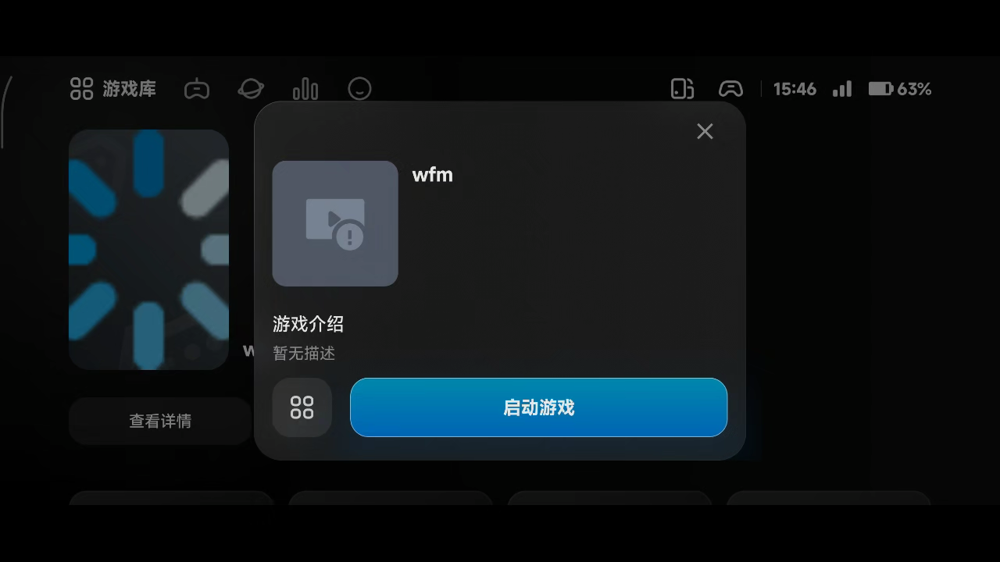

- 横屏为居中 Modal，宽度约屏幕一半、高度约三分之二。
- 左上显示缩略图与名称，中部只有游戏介绍；不展示路径、URI、EXE 等工程信息。
- 底部“启动游戏”使用青蓝渐变，是整个弹层唯一高饱和元素。
- 启动按钮左侧保留布局/方案快捷入口。
- 关闭后原游戏库位置和滚动状态保持不变。

竖屏同一内容变为底部 Sheet：

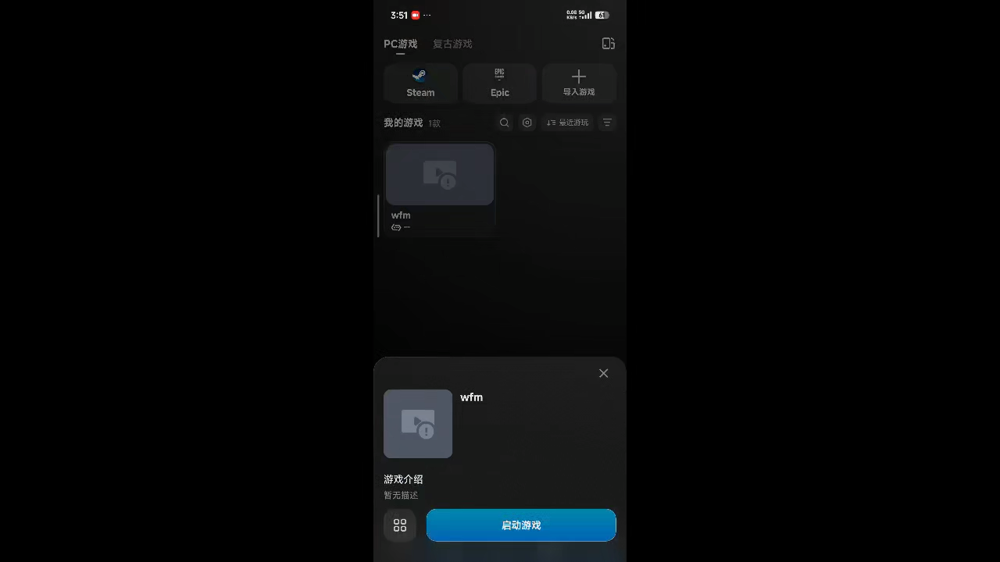

### 6.2 更多操作

横屏初始形态是锚定在游戏卡附近的轻量菜单：

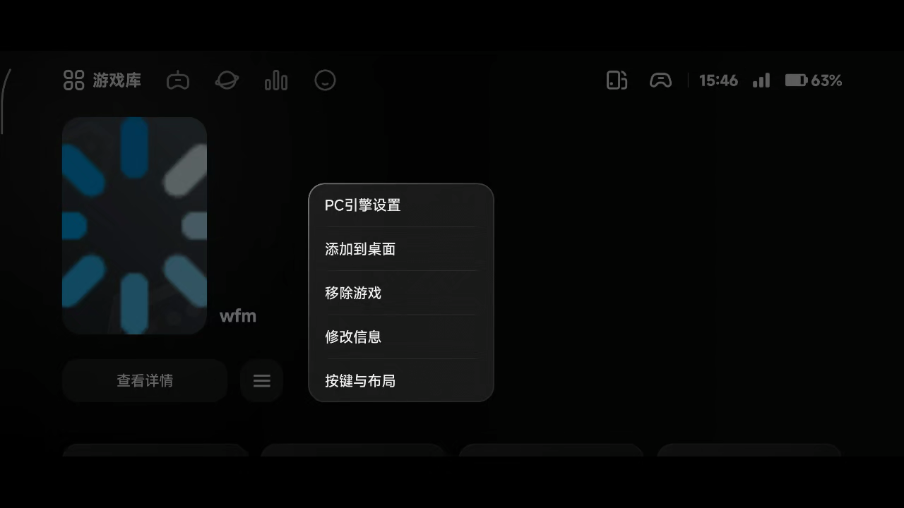

录屏后段显示更完整的大弹层，包含五个图标操作。竖屏则对应底部 Sheet。说明竞品对相同 Action Model 使用不同 presentation，而不是维护三套业务逻辑。

操作项建议按以下顺序复刻：

1. PC 引擎设置
2. 从桌面启动/添加到桌面
3. 移除游戏库
4. 修改信息
5. 按键与布局

当前 `GameDetailActivity` 把封面管理、权限、路径、名称编辑和启动集中在完整页面中，信息层级过重。应拆为：

- `GameLaunchSheet`：名称、封面、描述、布局入口、启动。
- `GameActionsSheet`：设置、编辑、移除、快捷方式、布局。
- `GameEditActivity/Sheet`：名称、封面、EXE、目录权限等低频编辑。

## 7. PC 引擎设置

### 7.1 页面容器

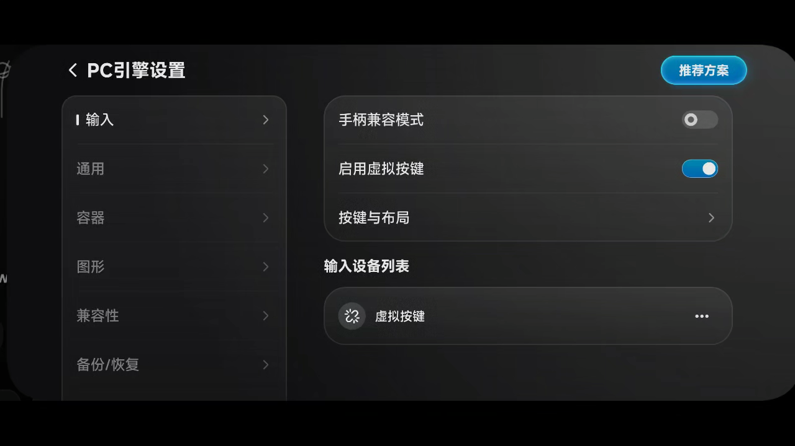

- 页面始终横屏。
- 左侧约占 30%，是圆角深色分类面板。
- 当前分类用白色短竖线和亮色文字表示，不使用大面积高亮背景。
- 右侧约占 55%，是独立圆角内容面板；长列表只在右侧滚动。
- 右上角“推荐方案”为固定高亮操作，不随分类滚动。
- 行模型统一为：标题、说明、当前值/开关、可选箭头。

录屏中分类实际包括：

| 分类 | 主要能力 |
|---|---|
| 输入 | 手柄兼容、虚拟按键、按键与布局、输入设备列表 |
| 通用 | 启动文件、语言、环境变量、启动参数、软键盘、重置数据 |
| 容器 | 进入虚拟桌面、运行 EXE/MSI/BAT/REG |
| 图形 | 分辨率、GPU 伪装、MangoHUD、窗口管理器、GPU 驱动、DXVK、VKD3D、显存 |
| 兼容性 | Proton/Wine、FEX 翻译器、音视频解码、音频驱动、DInput、CPU 核心限制 |
| 备份/恢复 | 备份存档到本地、从本地文件恢复 |
| 组件 | 已安装组件、版本、重装、安装新组件 |
| 开发者选项 | Wine 调试参数等专家配置 |

### 7.2 编辑器与选择器

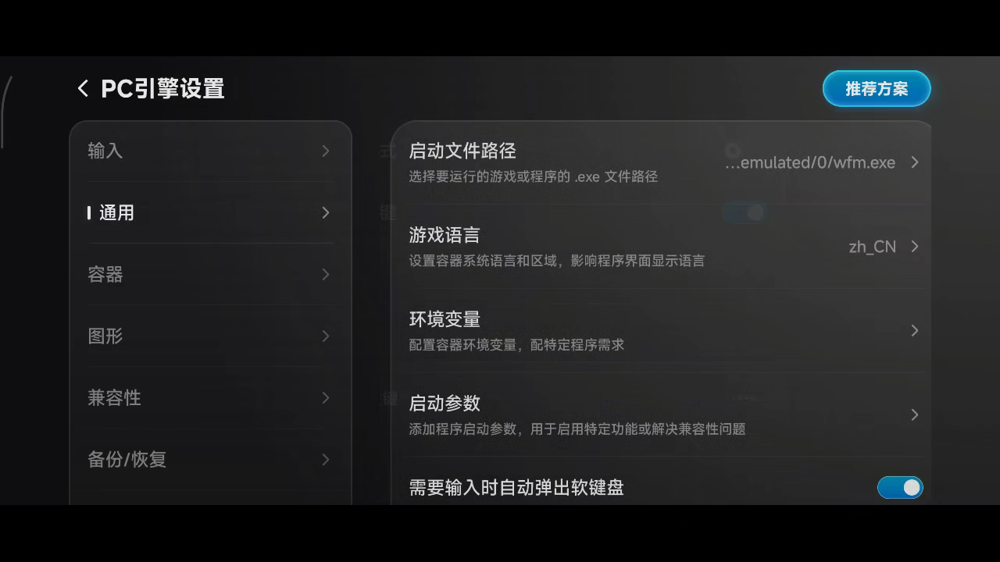

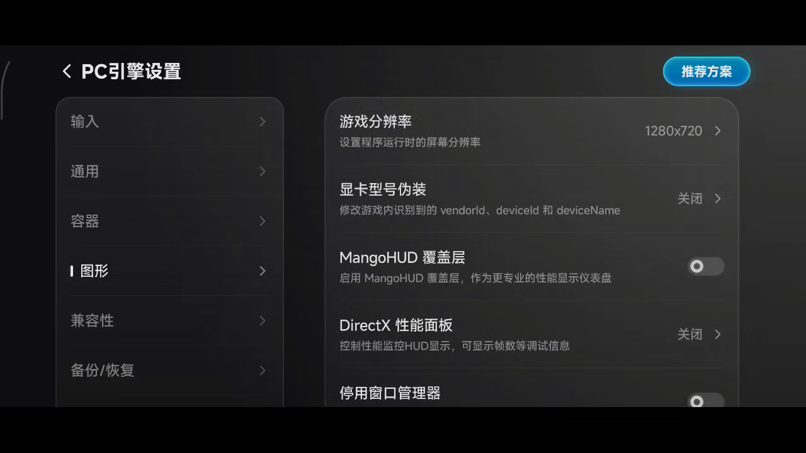

盖世游戏使用三类编辑容器：

- 单选列表 Modal：分辨率、GPU 驱动、DXVK、Proton、VRAM、音频驱动。
- 文本编辑 Modal：环境变量、启动参数、Wine 调试参数。
- 独立深层页面：FEX 参数、布局库、进程管理等复杂对象。

单选列表的关键行为：

- 当前项显示右侧勾选。
- 不兼容或未满足条件的版本直接置灰，而不是选择后再报错。
- 版本名保持原始技术字符串，分类标题和说明用中文解释。
- 修改没有全局“保存”按钮，推断为逐项即时持久化。

### 7.3 按键与布局

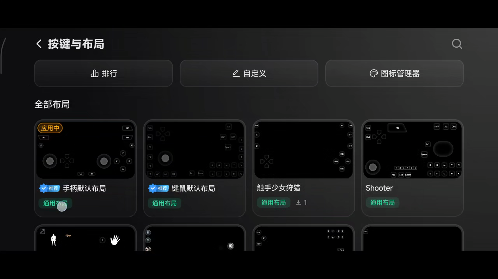

布局不是简单的本地 JSON 选择器，而是独立资产库：排行、自定义、图标管理器三个分区；卡片显示预览、适用类型、作者、下载量和当前应用状态。网络内容不在本阶段范围内，但本地模型仍应预留布局元数据、版本、来源、适用游戏和应用状态，避免后续再迁移数据结构。

### 7.4 推荐方案

“推荐方案”贯穿所有分类，说明它不是一个静态 preset 按钮，而是对当前游戏配置的持续入口。Games 已有 `RuntimeProfilePreset`，但 UI 应增加：

- 当前方案名称与来源。
- 应用方案前的差异预览。
- 对用户改动过的字段做覆盖提示。
- 方案应用后仍允许逐项修改。
- 组件缺失时把下载动作纳入应用流程。

## 8. 组件模型与下载链路

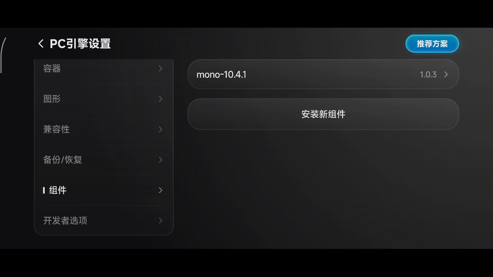

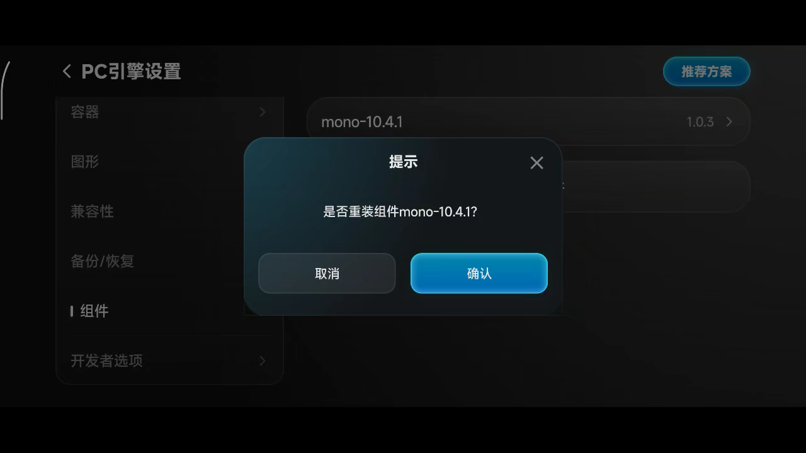

录屏证据显示两条组件入口：

1. 配置项选择版本，例如 GPU、DXVK、VKD3D、Proton、FEX。
2. PC 引擎设置中的“组件”，用于查看、重装和安装附加组件，如 mono、字体、PhysX、Gecko。

产品层不要求用户先去“组件中心”准备环境。正确链路应是：

1. 用户选择配置或点击启动。
2. 系统解析 `LaunchSpec` 的组件依赖。
3. 已安装且校验通过：直接继续。
4. 可下载但未安装：展示缺失组件、大小、网络条件和安装按钮。
5. 下载支持断点续传、校验、staging 安装和回滚。
6. 安装完成后自动回到原配置或继续启动，不要求重新操作。

当前 Games 的组件下载能力可以保留，但一级“组件”Tab 应降级为维护/诊断入口。用户主链路只看到“这个游戏需要什么”和“正在补齐什么”。

## 9. 启动链路

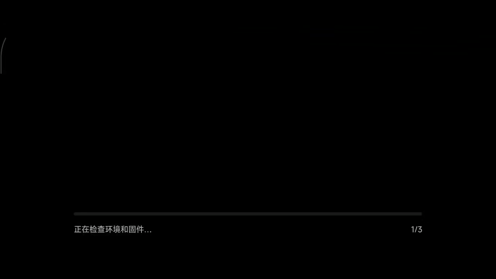

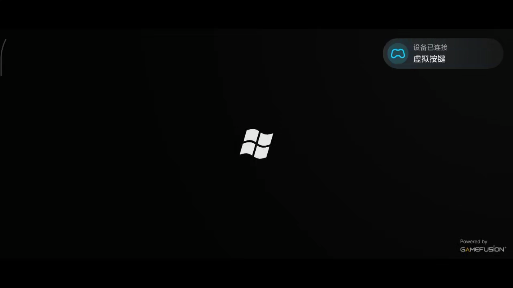

竞品明确展示三阶段启动，录屏可见第一阶段“正在检查环境和固件… 1/3”。之后进入 Windows 标志页，再进入桌面/游戏。

推荐映射到 Games 现有启动状态：

| 用户可见阶段 | 内部工作 | 默认 UI |
|---|---|---|
| 1/3 检查环境和固件 | SAF 权限、目录、EXE、组件索引、已安装版本、哈希、磁盘空间 | 阶段标题、总进度、取消 |
| 2/3 准备游戏环境 | 容器、挂载、prefix、环境变量、运行参数、X11/音频、输入 | 当前子任务；缺组件时切换下载进度 |
| 3/3 启动游戏 | 创建 `LaunchTask`、执行模块脚本、等待 X11 窗口/进程就绪 | Windows 标志、连接状态、重试/查看日志 |

对 `preflightxxx` 类错误的交互要求：

- 不显示内部类名、枚举名或原始异常作为主文案。
- 主文案必须落到用户动作，例如“游戏目录权限已失效”“缺少 DXVK 2.7.1”“启动文件不可读取”。
- 提供唯一主修复动作：重新授权、下载、重新选择 EXE、重试。
- “查看日志”作为二级操作，进入可选 TerminalSession 或结构化日志页。
- 启动失败保留 `LaunchTask` 和 JSONL 事件，返回游戏库后仍可查看。

这同时满足两种终端模式：默认隐藏终端；高级用户可选择创建 session，在原 Termux session 管理中查看实时日志。

## 10. 游戏会话与运行中控制中心

### 10.1 会话画面

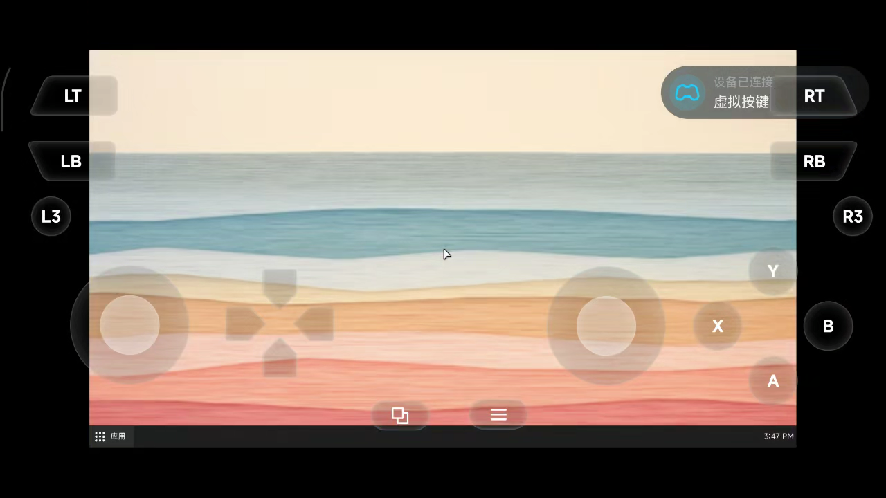

- X11/Windows 内容位于中心，必要时保留黑边，不强制拉伸。
- 虚拟按键覆盖在整个画面之上，左右分区符合手柄布局。
- 底部中间仅保留任务切换和菜单两个常驻按钮。
- 按键样式高对比但半透明，避免遮挡游戏。

### 10.2 右侧控制中心

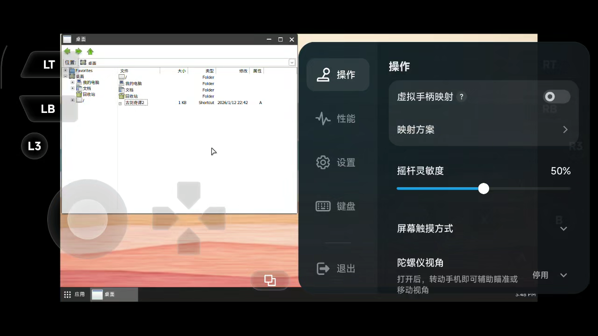

控制中心从右侧覆盖约一半屏幕，游戏画面仍可见。内部再分为窄分类栏和内容区：

- 操作：虚拟控制器、映射方案、摇杆灵敏度、触摸模式、陀螺仪。
- 性能：直连 GPU、AI 插帧、帧率限制、画质增强、HUD。
- 设置：系统音量、亮度、全屏等。
- 键盘：软键盘及快捷输入。
- 退出：固定在分类栏底部，弹出二次确认。

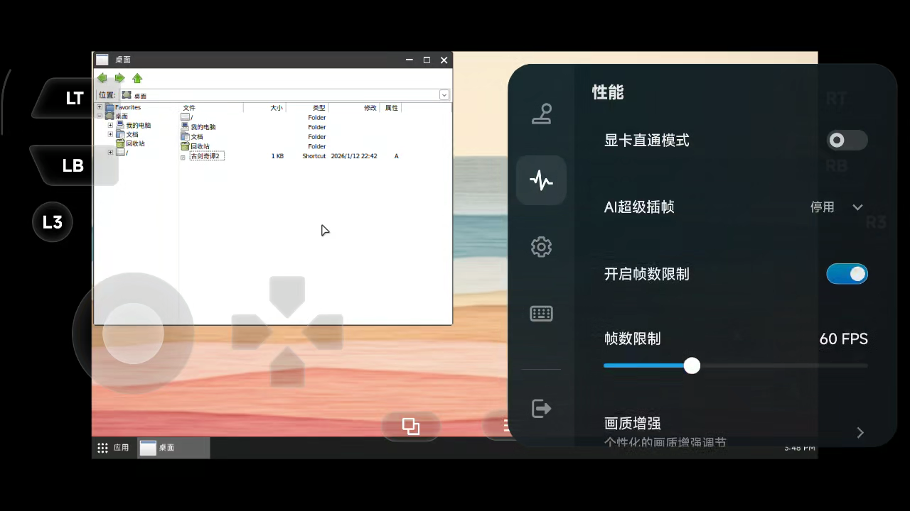

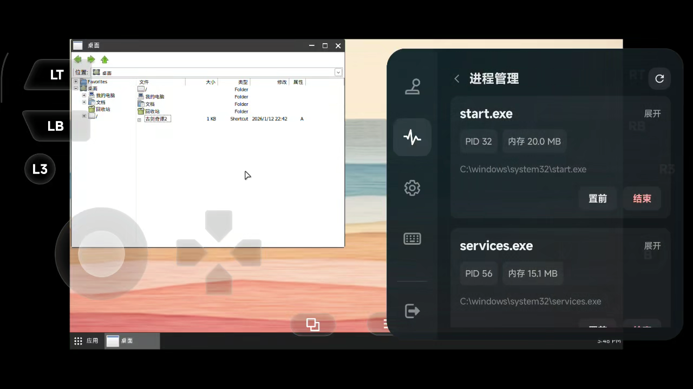

进程管理提供 exe、PID、内存、路径、置前、结束、展开和刷新。它把“终端中查看/管理进程”的能力转译成游戏用户可理解的操作，但底层仍可由 Termux 进程和结构化事件提供数据。

实现上应让 `GameSessionActivity` 成为真正的会话 Host：

- X11 Surface/渲染区域位于底层。
- 虚拟输入 Overlay 位于中层。
- Session Control Drawer、Modal、Toast 位于顶层。
- Drawer 打开不暂停游戏，除非特定操作要求。
- 返回键优先关闭 Modal → 关闭 Drawer → 弹出退出确认，不能直接 finish Activity。

## 11. 备份、恢复与 SAF

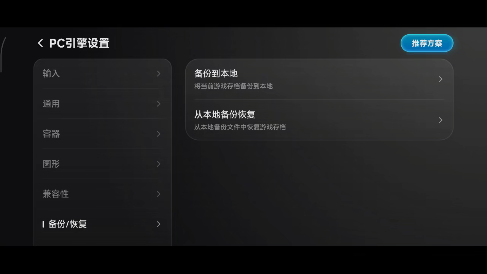

备份/恢复被放在单游戏 PC 引擎设置内，表明备份对象是游戏存档，而非整个运行环境。系统文件选择器负责选择目标，竞品同样受到 SAF 权限和目录限制。

Games 应明确区分：

- 游戏源目录授权：用于读取游戏文件和 EXE。
- 存档位置：来自 runtime profile 或运行时发现。
- 备份目标授权：只在导出/恢复时申请。
- runtime/container 快照：属于高级维护，不与“游戏存档备份”混用。

## 12. 视觉系统

以下数值为基于 1280 × 720 录屏的近似观察，不是原始设计标注。

| 元素 | 视觉规则 |
|---|---|
| 背景 | 接近纯黑，带低对比暗灰纹理/渐变 |
| 内容面板 | 深灰半透明；边缘使用约 1 px 的浅灰描边 |
| Modal | 比背景高一层的灰色，背景强遮罩；大圆角约 28–36 px |
| 主按钮 | 青色到蓝色纵向渐变，外沿有细亮边和弱光晕 |
| 强调方式 | 高饱和色只用于主操作、推荐方案和少量状态；普通选中项以白色为主 |
| 字体 | 标题粗体、正文中等、说明低对比；技术值不额外着色 |
| 列表行 | 行高约 80–110 px；标题、说明、值形成三层，不使用密集分割线 |
| 动效 | Modal 缩放/淡入、右侧 Drawer 滑入、横竖屏容器切换、启动阶段渐进 |

容易复刻错误的点：

- 不是“所有卡片都加蓝色描边”。
- 不是“所有操作都做成发光按钮”。
- 不是密集 Material 列表。
- 不是终端/赛博朋克视觉；其核心是游戏主机式的低信息密度和分层。

## 13. 与当前 Games 实现的差距

| 维度 | 当前实现 | 录屏目标 | 影响 |
|---|---|---|---|
| 主导航 | 底部游戏库/组件/设置 | 横屏顶部全局导航；竖屏底部导航 | 结构性差异 |
| 游戏库 | 导入 Hero + 两列网格 | 横屏大封面与快捷入口；竖屏紧凑网格 | 结构性差异 |
| 详情 | 独立 `GameDetailActivity` | 横屏 Modal、竖屏 Bottom Sheet | 交互连续性差异 |
| 组件 | 一级页面 | 配置依赖 + 高级维护页 | 用户心智差异 |
| 配置 | 普通表单 Activity | 横屏左侧分类 + 右侧内容 + 推荐方案 | 主要页面需重做 |
| 启动 | 工程状态较突出 | 三阶段全屏启动、技术细节下沉 | 错误体验需重做 |
| 会话 | 已有 Session Activity 基础 | X11 + 输入层 + 右侧控制中心 | 最大新增工作量 |
| 横竖屏 | 同一移动端结构 | 同一状态、不同导航和 presentation | 需要自适应 Shell |

可复用能力：

- `Game`、`RuntimeProfile`、`LaunchSpec`、`LaunchTask` 领域模型。
- Repository/Orchestrator 与持久任务。
- 组件索引、断点续传、哈希校验、staging 安装/回滚。
- SAF 导入、扫描、EXE 候选与权限状态。
- JSONL 启动事件与可选 TerminalSession Host adapter。
- X11 session 的 Activity/Host 基础。

需要新增或重构的核心 UI：

- `GamesShellActivity` 的横竖屏自适应导航。
- Library landscape/portrait 两套布局。
- 共享 `GameActionModel` 的 Modal/Bottom Sheet presentation。
- PC Engine Settings 主从容器与配置项注册表。
- Launch Stage 全屏页和错误修复动作映射。
- Session Control Drawer、虚拟输入 Overlay、进程/HUD 面板。

## 14. 建议实施分片

### Slice 1：自适应 Games Shell 与游戏库

- 横屏顶部导航、竖屏底部导航。
- 移除组件一级 Tab 和导入 Hero。
- 完成横屏大封面、竖屏紧凑网格、快捷入口、空状态和手柄焦点。
- 不改 Repository 和导入链路。

### Slice 2：详情、更多与编辑分层

- 用共享 Action Model 实现横屏 Modal、竖屏 Bottom Sheet。
- 启动、PC 引擎设置、修改信息、移除、重新授权接入现有能力。
- 将工程路径和权限诊断从启动弹层下沉到编辑/诊断界面。

### Slice 3：PC 引擎设置主从框架

- 左侧分类、右侧配置列表、推荐方案入口。
- 先映射已有 `RuntimeProfile` 字段，再逐步补输入、容器、图形、兼容性。
- 建立统一 Row/Picker/Editor 组件，避免每个字段单独实现 Activity。

### Slice 4：组件依赖式交付

- 将组件索引映射到 Runtime Profile 可选项。
- 未安装、已安装、不兼容、下载中、校验失败状态直接显示在选择器。
- 启动时自动解析依赖，完成后续跑 `LaunchTask`。

### Slice 5：启动阶段与可恢复错误

- 三阶段启动页。
- 将 preflight 内部错误映射为用户问题和修复动作。
- 保留“查看日志”和“在 TerminalSession 中运行”高级入口。

### Slice 6：运行中控制中心

- `GameSessionActivity` 分层容器。
- 先实现菜单、键盘、退出、音量/亮度、日志和进程列表。
- 再实现虚拟按键布局、映射、性能、HUD、触摸与陀螺仪。

## 15. 工作量评估

基于现有 Games 后端和 X11 能力已可用，只评估 UI、状态接线和必要适配：

| 分片 | 估算 |
|---|---:|
| 自适应 Shell 与游戏库 | 5–8 人日 |
| 详情/更多/编辑分层 | 4–6 人日 |
| PC 引擎设置主从框架 | 8–12 人日 |
| 组件依赖式交付 UI | 4–7 人日 |
| 启动阶段与错误恢复 | 4–7 人日 |
| 运行中控制中心基础 | 10–15 人日 |
| 手柄焦点、横竖屏、设备验证、回归 | 7–10 人日 |
| 合计 | 42–65 人日 |

不包含以下高风险能力的底层研发：完整虚拟手柄编辑器、触摸到手柄映射、陀螺仪、AI 插帧、GPU 直连、MangoHUD 数据采集。如果这些能力当前不存在，需独立估算，不能计入单纯 UI 复刻。

## 16. 第一阶段验收标准

第一阶段无需一次完成所有高级设置，但必须先纠正主链路：

- 横屏进入 Games 时不出现手机式底部三栏。
- 游戏库可用手柄和触摸完成选择、详情、更多、导入。
- 详情在横屏是 Modal、竖屏是 Bottom Sheet，关闭后保持库状态。
- PC 引擎设置使用左分类、右内容；现有 profile 字段全部可编辑并持久化。
- 启动展示明确阶段，不再把 `preflight` 内部名称作为主错误。
- 缺失组件可从启动流程直接下载、续传、校验、安装后继续。
- 游戏会话中可打开右侧控制中心，至少支持键盘、日志、进程、退出。
- 默认隐藏终端；启用 TerminalSession 模式后可在原 session 管理中查看运行日志。
