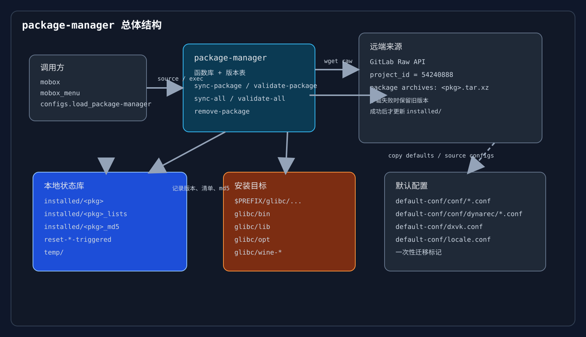
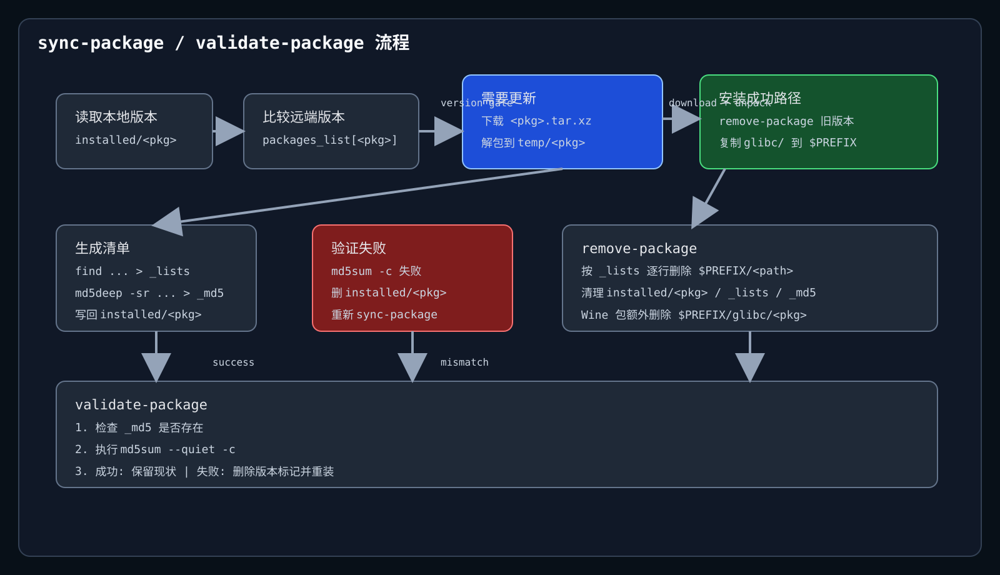
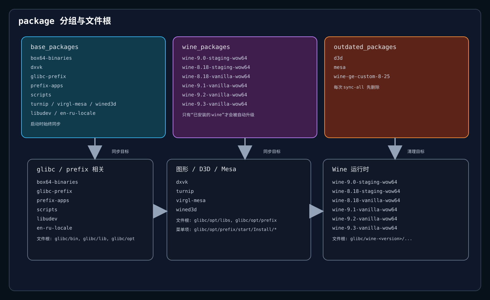

# package-manager 说明

本文基于仓库中的 `usr/glibc/opt/package-manager/`，对应设备上的路径是 `/data/data/com.termux/files/usr/glibc/opt/package-manager`。

## 概览

`package-manager` 不是独立交互程序，而是一个 Bash 函数库 + 状态文件集合。它被 `usr/glibc/opt/scripts/configs` 和 `usr/glibc/opt/scripts/mobox` 按需拉取、覆盖并 `source`，再由 `mobox_menu` 提供安装、卸载、校验入口。

核心职责：

- 从 GitLab Raw API 拉取包归档
- 按版本号判断是否需要更新
- 解包后把 `glibc/` 目录树复制到 `$PREFIX`
- 记录已安装文件列表和 MD5 清单
- 校验本地文件完整性
- 删除旧包和历史包名
- 管理一组一次性迁移标记

## 目录与文件

| 路径 | 作用 |
| --- | --- |
| `usr/glibc/opt/package-manager/package-manager` | 主脚本，定义全部函数和包版本表 |
| `usr/glibc/opt/package-manager/token` | 只保存 `PROJECT_ID=54240888` |
| `usr/glibc/opt/package-manager/installed/` | 本地包状态数据库 |
| `usr/glibc/opt/package-manager/temp/` | 下载与解包临时目录，运行时生成 |
| `usr/glibc/opt/package-manager/reset-wsi-present-triggered` | `wsi_present.conf` 迁移标记 |
| `usr/glibc/opt/package-manager/reset-locale2-triggered` | `locale.conf` 迁移标记 |
| `usr/glibc/opt/package-manager/reset-dxvk-triggered` | `dxvk.conf` 迁移标记 |
| `usr/glibc/opt/scripts/configs` | 提供 `load_package-manager` 和 `load_configs` |
| `usr/glibc/opt/scripts/mobox` | 启动时拉取最新 `package-manager` 并执行 `sync-all` |
| `usr/glibc/opt/scripts/mobox_menu` | 进入“Manage packages”后的交互入口 |
| `usr/glibc/opt/default-conf/` | 默认配置模板来源 |

## 启动链路

### 1. 加载脚本

`usr/glibc/opt/scripts/configs` 里的 `load_package-manager` 会：

1. 把当前 `package-manager` 备份成 `package-manager-bak`
2. 从 GitLab 拉取最新脚本
3. 成功则删除备份并 `source` 新脚本
4. 失败则回滚备份

`usr/glibc/opt/scripts/mobox` 也会做一次相同的拉取，然后立即调用 `sync-all`。

### 2. 配置加载

`load_configs` 会：

- 首次迁移时重写 `wsi_present.conf`、`locale.conf`、`dxvk.conf`
- 把 `default-conf/*` 复制到 `$PREFIX/glibc/opt`
- 重新 `source` `conf/*.conf` 和 `conf/dynarec/*.conf`
- 根据 `DEBUG_MODE` 导出一组环境变量

### 3. 包管理入口

`mobox_menu` 在“Manage packages”里调用：

- `validate-all`
- `sync-package <wine-package>`
- `remove-package <wine-package>`

## 状态文件模型

### `installed/<pkg>`

保存包的当前版本号，纯数字。`sync-package` 用它和 `packages_list` 里的目标版本比较。

### `installed/<pkg>_lists`

保存该包安装出的所有文件路径，路径是相对 `$PREFIX` 的。`remove-package` 会逐行删除这些路径。

### `installed/<pkg>_md5`

保存 `md5sum -c` 可直接消费的校验清单。`validate-package` 会用它检查本地文件是否被破坏。

### `reset-*-triggered`

一次性迁移标记。文件不存在时执行重置，执行完成后创建标记，避免重复覆盖用户配置。

### `temp/`

下载包、解压、生成清单时的临时目录。安装完成后会清理。

## 包分组

`package-manager` 里定义了三组包：

- `base_packages`：启动所需基础包，`sync-all` 每次都会检查
- `wine_packages`：Wine 版本包，只有本地已安装时才参与自动同步
- `outdated_packages`：旧包名迁移清理项，每次 `sync-all` 都先删除

### 版本表

| 包 | 版本 |
| --- | --- |
| `box64-binaries` | `10` |
| `dxvk` | `2` |
| `glibc-prefix` | `2` |
| `prefix-apps` | `2` |
| `scripts` | `27` |
| `turnip` | `8` |
| `virgl-mesa` | `1` |
| `wined3d` | `1` |
| `wine-9.0-staging-wow64` | `1` |
| `wine-8.18-staging-wow64` | `1` |
| `wine-8.18-vanilla-wow64` | `1` |
| `wine-9.1-vanilla-wow64` | `2` |
| `wine-9.2-vanilla-wow64` | `1` |
| `wine-9.3-vanilla-wow64` | `1` |
| `libudev` | `1` |
| `en-ru-locale` | `1` |

## 模块说明

### `wget-git` / `wget-git-q`

封装 GitLab Raw API 下载。目标项目由 `PROJECT_ID=54240888` 指定。

### `remove-package`

输入包名后，按 `installed/<pkg>_lists` 删除所有文件，并清理：

- `installed/<pkg>`
- `installed/<pkg>_lists`
- `installed/<pkg>_md5`

如果包名属于 `wine_packages`，还会删除 `$PREFIX/glibc/<pkg>` 整个 Wine 前缀。

### `sync-package`

执行更新的主路径：

1. 读取本地版本号
2. 对比 `packages_list`
3. 远程版本更高时下载 `<pkg>.tar.xz`
4. 解包到临时目录
5. 先删旧包，再复制新 `glibc/` 到 `$PREFIX`
6. 生成新的 `_lists` 和 `_md5`
7. 写回新版本号

### `validate-package`

校验路径：

1. 检查是否存在 `_md5`
2. 执行 `md5sum --quiet -c`
3. 成功则保留本地包
4. 失败则删除版本记录并重新 `sync-package`

### `sync-all`

启动期全量同步：

- 先清理 `outdated_packages`
- 再同步 `base_packages`
- 最后只同步已安装的 `wine_packages`

### `validate-all`

批量校验：

- 校验所有 `base_packages`
- 校验已安装的 `wine_packages`

## 各包职责

### `box64-binaries`

提供 `glibc/bin/box64`、`glibc/etc/binfmt.d/box64.conf` 和一组运行时库：

- `libcrypto.so.1.1`
- `libssl.so.1.1`
- `libgcc_s.so.1`
- `libstdc++.so.5`
- `libstdc++.so.6`
- `libpng12.so.0`
- `libunwind.so.8`

同时还带两个 box 构建包：`feb14.tar.xz`、`mar3.tar.xz`。

### `dxvk`

提供 D3D/Vulkan 相关兼容包和启动器，主要落在：

- `glibc/opt/libs/d3d/*`
- `glibc/opt/prefix/d3d/*`
- `glibc/opt/prefix/start/Install/1.d3d is not installed/*`

内容包括 `dxvk`、`d8vk`、`vkd3d`、`dxvk-async` 等变体。

### `glibc-prefix`

基础 glibc 资源包，主要是：

- Vulkan ICD
- i18n/charmaps

它是整个 `glibc/` 运行环境的底座，体量最大。

### `prefix-apps`

安装到 prefix 的 Windows 依赖包：

- `install.bat`
- `7z-inst.exe`
- `k-lite-basic.exe`
- `oalinst.exe`
- `physx.msi`
- `VC_redist.x64.exe`
- `directx.7z`

### `scripts`

脚本与辅助工具集合，主要是：

- `glibc/bin/ib`
- `glibc/bin/ib.exe`
- `glibc/bin/di.dll`
- `glibc/etc/box64.box64rc`
- `glibc/opt/apps/7z.exe`
- `glibc/opt/apps/paint.exe`
- `glibc/opt/apps/tfm.exe`
- `glibc/opt/apps/servman.exe`
- `glibc/opt/apps/f5taskmgr.exe`
- `glibc/opt/apps/pgup-f6-pgdn-f7.exe`
- `glibc/opt/apps/TrueTransparency/*`

### `turnip`

提供 Qualcomm/Turnip 路线的 Mesa 变体：

- `turnip-v2`
- `turnip-v3.5`
- `turnip-v4`
- `turnip-v5`
- `turnip-v6.5`
- `zink`

对应的 `.bat` 和开始菜单链接都在清单中。

### `virgl-mesa`

提供 VirGL Mesa 变体：

- `virgl-mesa-18`
- `virgl-mesa-19`
- `virgl-mesa-22`
- `virgl-mesa-24`

### `wined3d`

提供 WineD3D 变体和对应菜单项：

- `wined3d-4.13`
- `wined3d-7.2`
- `wined3d-7.21`
- `wined3d-7.8`
- `wined3d-8.0.2`
- `wined3d-8.20`

### `libudev`

只提供 `glibc/lib/libudev.so.0` 和 `glibc/lib/libudev.so.1`，用于兼容依赖 `libudev` 的程序。

### `en-ru-locale`

提供 `en_US.utf8` 与 `ru_RU.utf8` locale 数据，目的是修复 Wine 下的 Unicode/本地化问题。

### `wine-*`

每个 Wine 包都是一个完整的前缀树，落在：

- `glibc/wine-<version>/lib/wine/i386-windows/*`
- `glibc/wine-<version>/lib64/wine/x86_64-windows/*`
- `glibc/wine-<version>/...`

它们是可选择的 Wine 运行时，不是单独 DLL 包。

## 默认配置依赖

`load_configs` 依赖 `usr/glibc/opt/default-conf/` 下的模板：

- `conf/*.conf`
- `conf/dynarec/*.conf`
- `dxvk.conf`
- `locale.conf`
- `last-resolution.conf`

其中被一次性重置的文件是：

- `conf/wsi_present.conf`
- `locale.conf`
- `dxvk.conf`

## 运行时特征

- `packages_list` 是远端版本门控
- `_lists` 是卸载清单
- `_md5` 是完整性清单
- `sync-all` 会先删旧包再装新包
- `validate-all` 只负责发现损坏并自动修复
- `mobox` 启动时会自动同步，用户通常不用手动点更新

## 文件清单规模

| 包 | `_lists` 条目数 | `_md5` 条目数 |
| --- | ---: | ---: |
| `box64-binaries` | 11 | 11 |
| `dxvk` | 23 | 23 |
| `glibc-prefix` | 4580 | 6841 |
| `libudev` | 1 | 2 |
| `prefix-apps` | 7 | 7 |
| `scripts` | 214 | 214 |
| `turnip` | 16 | 16 |
| `virgl-mesa` | 12 | 12 |
| `wined3d` | 18 | 18 |
| `en-ru-locale` | 24 | 24 |
| `wine-8.18-staging-wow64` | 2369 | 2373 |
| `wine-8.18-vanilla-wow64` | 2323 | 2325 |
| `wine-9.0-staging-wow64` | 2375 | 2379 |
| `wine-9.1-vanilla-wow64` | 2332 | 2334 |
| `wine-9.2-vanilla-wow64` | 2332 | 2334 |
| `wine-9.3-vanilla-wow64` | 2336 | 2338 |

## 结论

这个包管理器本质上是 Mobox/Termux glibc 环境的“远程状态同步层”：

- 脚本本身负责定义规则
- `installed/` 负责记录状态
- GitLab 负责分发包内容
- `default-conf/` 负责配置基线
- `mobox_menu` 负责给用户一个交互入口
