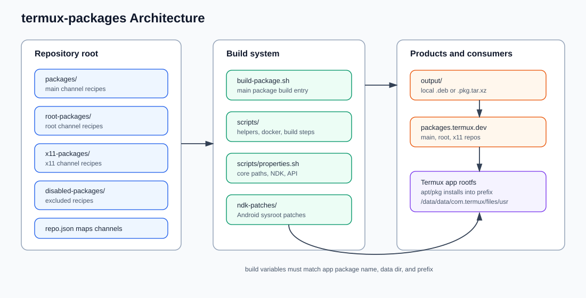
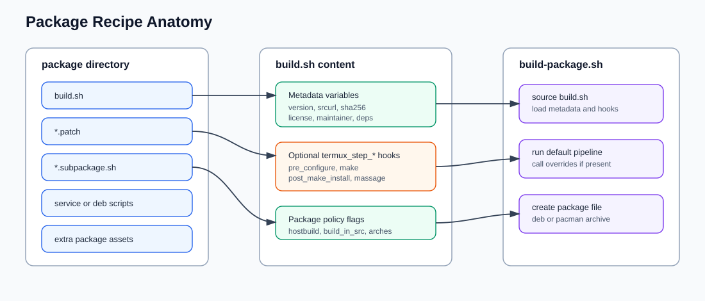
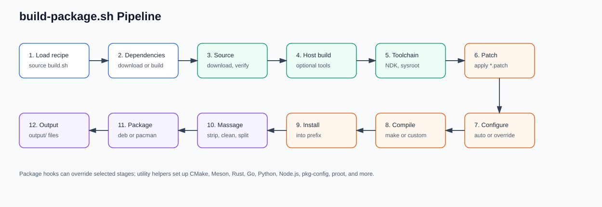
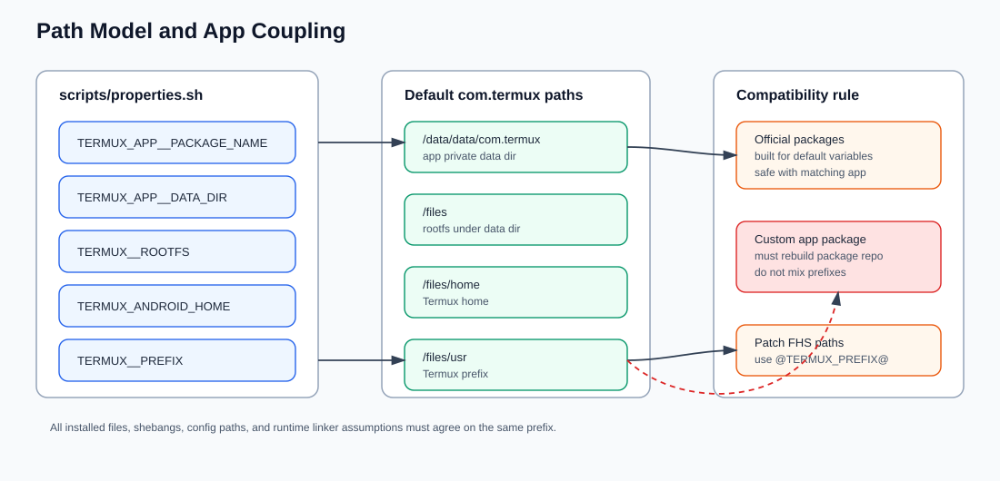

# termux-packages 架构和工作流程

本文描述 upstream [`termux/termux-packages`](https://github.com/termux/termux-packages) 的仓库结构、包配方模型、构建流水线，以及它和 `termux-app` 的路径耦合关系。

> 名称说明：官方仓库名是 `termux-packages`；本文文件名沿用本地约定 `termux-package-architecture.md`。

## 1. 总体定位

`termux-packages` 不是 Termux App 本体，而是 Termux 的包构建系统和包配方仓库。它负责把上游开源项目源码交叉编译成 Termux 可安装的包文件，最终由 `apt/pkg` 在 Termux 环境中安装使用。



核心边界：

- `termux-app` 提供 Android 应用、终端运行环境、bootstrap/rootfs 初始化入口。
- `termux-packages` 提供 `$TERMUX__PREFIX` 下的软件包内容。
- 包运行时依赖固定的 Termux 路径模型，默认面向 `com.termux`。
- 如果 app package name、data dir 或 prefix 改了，官方仓库编出的包不能直接混用，需要按相同 core variables 重建包仓库。

## 2. 仓库结构

官方仓库根目录的关键组成：

| 路径 | 作用 |
| --- | --- |
| `build-package.sh` | 构建一个或多个包的主入口。 |
| `build-all.sh` | 批量构建可用包。 |
| `clean.sh` | 清理构建环境。 |
| `scripts/` | 构建系统内部脚本、Docker 启动脚本、工具链配置、依赖排序等。 |
| `scripts/properties.sh` | Termux app/package/core 路径、NDK、SDK、API level 等全局构建变量。 |
| `packages/` | `main` channel 包配方。 |
| `root-packages/` | `root` channel 包配方。 |
| `x11-packages/` | `x11` channel 包配方。 |
| `disabled-packages/` | 当前禁用的包配方。 |
| `ndk-patches/` | Android NDK sysroot patch。 |
| `sample/` | 新包模板。 |
| `repo.json` | channel 到目录的映射和仓库元信息。 |
| `output/` | 本地构建产物输出目录，默认不存在。 |

三个主要 channel：

- `main`：默认启用，普通终端包。
- `root`：需要 root 能力的包，通过 `root-repo` 启用。
- `x11`：X11/GUI 相关包，通过 `x11-repo` 启用。

## 3. 包配方模型

每个包通常是一个目录，核心是 `build.sh`。构建系统 source 这个脚本读取元数据，并在默认构建步骤中调用可选的 `termux_step_*` override。



典型 `build.sh` 字段：

| 变量 | 含义 |
| --- | --- |
| `TERMUX_PKG_HOMEPAGE` | 上游主页。 |
| `TERMUX_PKG_DESCRIPTION` | 一行描述。 |
| `TERMUX_PKG_LICENSE` | SPDX license。 |
| `TERMUX_PKG_MAINTAINER` | 维护者。 |
| `TERMUX_PKG_VERSION` | 上游版本。 |
| `TERMUX_PKG_REVISION` | 同版本重建号；版本升级时应删除。 |
| `TERMUX_PKG_SRCURL` | 源码 tarball 或 git URL。 |
| `TERMUX_PKG_SHA256` | 源码校验和。 |
| `TERMUX_PKG_DEPENDS` | 运行时依赖。 |
| `TERMUX_PKG_BUILD_DEPENDS` | 仅构建期依赖。 |
| `TERMUX_PKG_EXTRA_CONFIGURE_ARGS` | 传给默认 configure 阶段的额外参数。 |
| `TERMUX_PKG_BUILD_IN_SRC` | 是否在源码目录内构建。 |
| `TERMUX_PKG_HOSTBUILD` | 是否需要先构建 host tool。 |
| `TERMUX_PKG_PLATFORM_INDEPENDENT` | 是否架构无关。 |
| `TERMUX_PKG_ON_DEVICE_BUILD_NOT_SUPPORTED` | 是否禁止在设备上构建。 |

常见目录内容：

- `*.patch`：源码 patch，在源码获取后自动应用。
- `*.patch.beforehostbuild`：host build 前应用的 patch。
- `*.subpackage.sh`：子包定义。
- `debian/` 或 maintainer scripts：安装/卸载脚本。
- service scripts：给 `termux-services` 使用。

常用 override：

- `termux_step_post_get_source`
- `termux_step_pre_configure`
- `termux_step_configure`
- `termux_step_make`
- `termux_step_make_install`
- `termux_step_post_make_install`
- `termux_step_pre_massage`
- `termux_step_post_massage`

## 4. 构建环境

推荐构建方式是官方 Docker 镜像：

```sh
./scripts/run-docker.sh
./scripts/run-docker.sh ./build-package.sh -f -I bash
```

Docker 容器内仓库挂载路径是：

```text
/home/builder/termux-packages
```

其他方式：

- VirtualBox/Vagrant。
- Ubuntu/Arch host 直接安装 SDK/NDK 和依赖。
- 在 Termux App 内 on-device build；不是所有包支持。

常用构建命令：

| 命令 | 用途 |
| --- | --- |
| `./build-package.sh bash` | 构建 `bash` 及其依赖，默认 `aarch64`。 |
| `./build-package.sh -I bash` | 依赖从官方包仓库下载，不本地构建。 |
| `./build-package.sh -f -I bash` | 强制重建当前包，依赖下载；常用于开发验证。 |
| `./build-package.sh -F bash` | 强制重建当前包及依赖。 |
| `./build-package.sh -a arm bash` | 指定架构。 |
| `./build-package.sh -f -r -I bash` | 强制重建并重新下载源码。 |

支持架构：

- `aarch64`
- `arm`
- `i686`
- `x86_64`

## 5. 构建流水线

`build-package.sh` 的流程是固定 pipeline + 包级 hook。



主要阶段：

1. 初始化构建变量和架构变量。
2. source `packages/<pkg>/build.sh`，读取 metadata。
3. 解析依赖；`-I/-i` 时下载依赖包，否则递归构建依赖。
4. 创建 timestamp，用于后续识别本包安装了哪些文件。
5. 下载源码并校验 `TERMUX_PKG_SHA256`。
6. 如需要，执行 host build。
7. 配置 Android NDK standalone toolchain。
8. 应用 package 目录下的 patch。
9. 自动或自定义 configure。
10. 编译。
11. install 到 `$TERMUX__PREFIX`。
12. 根据 timestamp 抽取本包修改的文件到 massage 目录。
13. strip ELF、压缩 manpage、清理无关文件、处理 subpackages。
14. 生成 `.deb` 或 `.pkg.tar.xz` 到 `output/`。

默认构建系统能识别：

- Autotools
- CMake
- Meson
- Haskell/Cabal

语言和工具链 helper 包括：

- `termux_setup_cmake`
- `termux_setup_meson`
- `termux_setup_ninja`
- `termux_setup_rust`
- `termux_setup_golang`
- `termux_setup_nodejs`
- `termux_setup_python_pip`
- `termux_setup_pkg_config_wrapper`
- `termux_setup_proot`

## 6. 路径模型和 app 耦合

包构建时写死的是 Termux 的虚拟 rootfs/prefix 模型，不是 FHS 原生路径。



默认关键路径：

| 变量/路径 | 默认含义 |
| --- | --- |
| `TERMUX_APP__PACKAGE_NAME` | `com.termux` |
| `TERMUX_APP__DATA_DIR` | `/data/data/com.termux` |
| `TERMUX__ROOTFS` | `/data/data/com.termux/files` |
| `TERMUX_ANDROID_HOME` | `/data/data/com.termux/files/home` |
| `TERMUX__PREFIX` | `/data/data/com.termux/files/usr` |

影响：

- 上游软件里的 `/usr`、`/etc`、`/var`、`/tmp` 等 FHS 路径通常需要 patch 到 prefix 下。
- patch 文件里不要硬编码本地绝对路径，使用 `@TERMUX_PREFIX@` 和 `@TERMUX_HOME@`。
- `TERMUX_PKG_DEPENDS` 只放运行时依赖；构建期工具放 `TERMUX_PKG_BUILD_DEPENDS`。
- app package name 或 prefix 改动后，官方包仓库的包运行时路径会不匹配。

对当前 `termux-app` fork 的直接结论：

- 如果仍使用 `com.termux` 和默认 prefix，可以复用官方包仓库。
- 如果改为自定义包名或 data dir，需要同步修改 `termux-packages/scripts/properties.sh` 并重建包。
- bootstrap、内置 assets、默认 apt source、`termux-exec`、包内 shebang/path 都必须使用同一套 prefix。

## 7. 新增或更新包的工作流

新增包：

1. 选择 channel：`packages/`、`root-packages/` 或 `x11-packages/`。
2. 新建 `<pkg>/build.sh`。
3. 填写 homepage、description、license、maintainer、version、srcurl、sha256。
4. 添加运行时依赖和构建期依赖。
5. 必要时添加 patch 和 `termux_step_*` override。
6. 用 Docker 执行 `./build-package.sh -f -I <pkg>`。
7. 安装产物验证命令、动态链接、路径、配置文件、服务脚本。

更新包：

1. 修改 `TERMUX_PKG_VERSION`。
2. 如果存在 `TERMUX_PKG_REVISION`，删除它。
3. 下载新源码并更新 `TERMUX_PKG_SHA256`。
4. 处理失效 patch：删除已 upstream 的 patch，或重新生成 patch。
5. 执行 `./build-package.sh -f -I <pkg>`。
6. 如果只是 patch/config 改动且版本不变，设置或递增 `TERMUX_PKG_REVISION`。

本地源码调试：

- 可把 `TERMUX_PKG_SRCURL` 指向 `file:///home/builder/termux-packages/sources/<pkg>`。
- Docker 构建时本地源码应放在仓库目录内，避免容器不可见。
- 对本地目录格式，未提交改动也会进入构建；对 `git+file://`，通常需要提交后才会被构建。

## 8. 常见问题点

- 上游源码假设 FHS：需要 patch 路径、socket、pidfile、cache、temp dir。
- Android bionic 不等同 glibc：可能缺 syscall、locale、pthread、resolver、procfs 行为。
- Android 10+ 对 `/proc`、网络统计等有额外限制。
- ELF 需要经过 `termux-elf-cleaner`，去掉 Android linker 不支持的条目。
- 依赖分类错误会导致包运行时缺库或安装体积膨胀。
- 使用非确定性源码 URL 会破坏 checksum 和可复现构建。
- 版本降级或版本规则改变时需要 epoch，例如 `1:5.0.0`。

## 9. 资料来源

- [`termux/termux-packages` README](https://raw.githubusercontent.com/termux/termux-packages/master/README.md)
- [Build Environment](https://raw.githubusercontent.com/wiki/termux/termux-packages/Build-environment.md)
- [Building Packages](https://raw.githubusercontent.com/wiki/termux/termux-packages/Building-packages.md)
- [Creating New Package](https://raw.githubusercontent.com/wiki/termux/termux-packages/Creating-new-package.md)
- [Termux Filesystem Layout](https://raw.githubusercontent.com/wiki/termux/termux-packages/Termux-file-system-layout.md)
- [CONTRIBUTING.md](https://raw.githubusercontent.com/termux/termux-packages/master/CONTRIBUTING.md)
